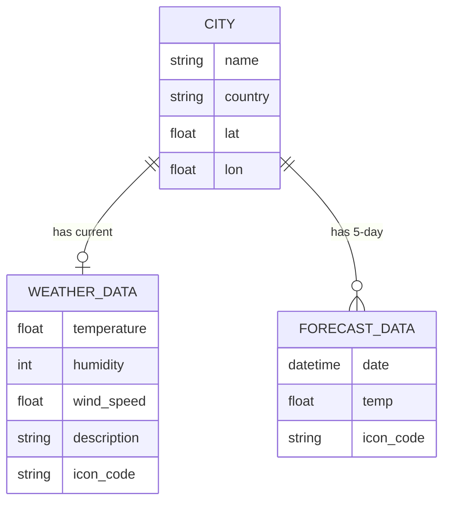
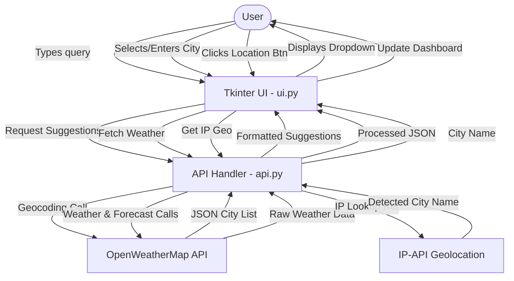

# 🌦️ Weather Forecast Pro

A modern, premium weather forecasting application built with **Python**, **Tkinter**, and the **OpenWeatherMap API**. 


## 🚀 Key Features
- **Smart Location Suggestions**: Real-time dropdown suggestions as you type city names.
- **Current Weather Status**: Detailed temperature, humidity, wind speed, and conditions.
- **5-Day Forecast**: Visual daily summaries of upcoming weather trends.
- **Auto-Location Detection**: Instant IP-based geolocation with one click.
- **Premium Dark UI**: Sleek, slate-themed interface designed for maximum readability and modern aesthetic.
- **Dynamic Weather Icons**: High-quality visual indicators fetched dynamically for each condition.

---

## 🏛️ System Architecture

### 📊 Entity Relationship Diagram (ERD)
Even without a traditional SQL database, the application manages structured data relationships shown below:



---

### 🔄 Data Flow Diagram (DFD)
The movement of data from user input to API retrieval and final UI rendering:



---

## 🛠️ Technology Stack
- **Python 3.x**: Core programming language.
- **Tkinter**: Built-in Python library for the GUI.
- **Pillow (PIL)**: High-performance image processing for weather icons.
- **Requests**: HTTP library for API communication.
- **OpenWeatherMap API**: Primary data source for weather and geocoding.

---

## ⚙️ Quick Start (Recommended)
The easiest way to run the project on Windows is using the automated launcher:

1.  **Double-click `setup_and_run.bat`**
2.  The script will automatically:
    *   Create a virtual environment (`venv`).
    *   Install all necessary dependencies (`requests`, `Pillow`).
    *   Initialize and launch the Weather Forecast Pro application.

---

## 🛠️ Manual Installation (Optional)
If you prefer to set up the environment manually:

### 1. Install Dependencies
```bash
pip install -r requirements.txt
```

### 2. Run the Application
```bash
python main.py
```

---

## 📁 Project Structure
- `main.py`: Entry point and window initialization.
- `ui.py`: Manages the entire visual layout, styles, and user interactions.
- `api.py`: Logic layer for API request construction and data parsing.
- `config.py`: Centralized theme colors, API endpoints, and global settings.

---

## ⚠️ Troubleshooting
- **Invalid API Key (401)**: 
  - Ensure you have **verified your email** on the OpenWeatherMap website.
  - Newly created keys can take up to 2 hours to activate.
- **Network Error**: Check your internet connection.

---

## 🎨 License
This project is open-source and free for educational and personal use.
